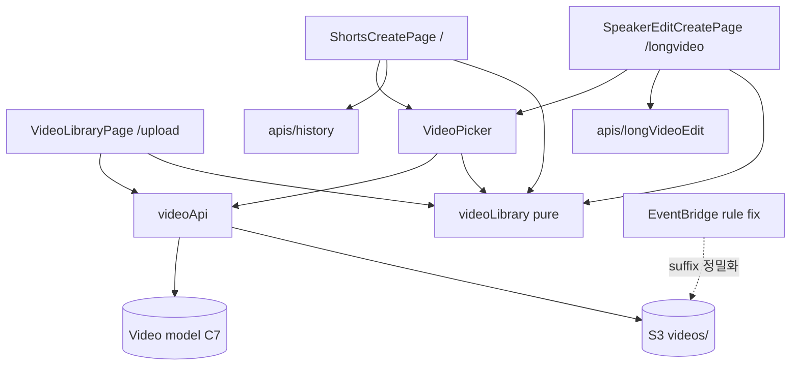

# Application Design — upload-library (통합 문서)

> components / component-methods / services / component-dependency 내용을 단일 문서로 통합. (개별 파일 분할 대신 통합본 1개로 유지 — 소규모 유닛이라 문서 분산이 오히려 추적을 해침. 계획 체크리스트의 4개 아티팩트 항목은 본 문서의 §1~§4가 각각 대응.)

## §1 Components (components.md)

### C1: `VideoLibraryPage` (신규 — `/upload` 대체 구현)
- **Purpose**: 영상 라이브러리 — 업로드 + 목록 (US-1, US-2)
- **Responsibilities**: 제목 입력(기본 파일명), StorageManager 업로드(`videos/library/{videoId}/SOURCE.mp4`), 업로드 완료 시 Video 레코드 생성, 본인 라이브러리 목록 표시
- **Interface**: 라우트 `/upload`. props 없음 (self-contained)

### C2: `VideoPicker` (신규 — 공유 컴포넌트)
- **Purpose**: "이미 업로드된 영상" 선택 UI (US-3, US-5 공용)
- **Responsibilities**: 라이브러리(Video) + 레거시(History/LongVideoEdit) 병합 목록 표시, S3 실존 대사 결과 반영, 빈 상태 시 `/upload` 유도, 선택 이벤트 방출
- **Interface**: `onSelect(video: SelectableVideo)` 콜백 prop

### C3: `ShortsCreatePage` (개편 — `/` 대체, 기존 VideoUploadComponent 대체)
- **Purpose**: 쇼츠만들기 = VideoPicker + 쇼츠 메타데이터 폼 (US-3, US-4)
- **Responsibilities**: 선택 → 폼(모델/클립수/테마/길이) → startShortsProcessing 호출 → `/history` 이동

### C4: `SpeakerEditCreatePage` (개편 — `/longvideo` 대체, 기존 LongVideoUploadComponent 대체)
- **Purpose**: 화자별 편집 = VideoPicker + 화자 메타데이터 폼 (US-5, US-6)
- **Responsibilities**: 선택 → 폼(모델/발표자 수/이름) → startSpeakerEditProcessing 호출 → `/longvideo/history` 이동

### C5: `videoLibrary` (신규 — 순수 로직 모듈, `src/data/videoLibrary.ts`)
- **Purpose**: 키 생성/파싱·목록 병합·검증의 순수 함수 집합 — **PBT 대상** (PBT-01/07)
- **Responsibilities**: 라이브러리/파이프라인 키 생성, 키 → 소스 유형 판별, 레코드×S3키 병합·대사, 5GB 검증

### C6: `videoApi` (신규 — `src/apis/video.ts`)
- **Purpose**: Video 모델 CRUD + S3 list/copy 래퍼 (I/O 계층)

### C7: `Video` 모델 (신규 — `amplify/data/resource.ts`)
- **Fields**: title(string, required), s3Key(string, required), sizeBytes(integer), status(enum: UPLOADED), owner auth
- 참고: 기존 History/LongVideoEdit 모델 불변

### C8: EventBridge 쇼츠 룰 (수정 — `amplify/backend.ts`)
- **Purpose**: `RAW.mp4` suffix가 `LONG_RAW.mp4`·라이브러리 키에 매칭되지 않도록 정밀화 (US-8)

## §2 Component Methods (component-methods.md)

### C5 `videoLibrary` (순수 — 전부 PBT 후보)
| 메서드 | 시그니처 | 목적 |
|---|---|---|
| `librarySourceKey` | `(videoId: string) => string` | `videos/library/{videoId}/SOURCE.mp4` 생성 |
| `pipelineDestKey` | `(kind: 'shorts'\|'speaker', recordId: string) => string` | `videos/{id}/RAW.mp4` 또는 `videos/{id}/LONG_RAW.mp4` |
| `classifyKey` | `(s3Key: string) => 'library'\|'shorts-raw'\|'speaker-raw'\|'other'` | 키 → 소스 유형 (round-trip/분류 속성) |
| `mergeSelectableVideos` | `(libs: VideoRecord[], histories: HistoryRecord[], edits: EditRecord[], existingKeys: Set<string>) => SelectableVideo[]` | 병합+실존 대사 (invariant: 결과 ⊆ 입력, 유실 제외) |
| `validateCopySize` | `(sizeBytes: number \| undefined) => { ok: boolean; reason?: string }` | 5GB 한도 (NFR-3) |

### C6 `videoApi` (I/O)
| 메서드 | 시그니처 | 목적 |
|---|---|---|
| `createVideo` | `(title, s3Key, sizeBytes) => Promise<Video>` | 레코드 생성 |
| `fetchVideos` | `() => Promise<Video[]>` | 본인 라이브러리 |
| `listExistingSourceKeys` | `() => Promise<Set<string>>` | S3 `list({path:'videos/'})` → 실존 원본 키 집합 (AD-4) |
| `copyToPipeline` | `(sourceKey, destKey) => Promise<void>` | Amplify Storage `copy` |

### C3/C4 오케스트레이션 메서드 (컴포넌트 내부)
| 메서드 | 흐름 |
|---|---|
| `startShortsProcessing(sel, meta)` | `createHistory(...)` → `copyToPipeline(sel.s3Key, pipelineDestKey('shorts', history.id))` → navigate `/history` |
| `startSpeakerEditProcessing(sel, meta)` | `createLongVideoEdit(...)` → `copyToPipeline(sel.s3Key, pipelineDestKey('speaker', edit.id))` → navigate `/longvideo/history` |

## §3 Services (services.md)
서버 측 신규 서비스 없음 (D3/NFR-1 — 파이프라인 불변). 오케스트레이션은 전부 프론트 C3/C4에서 수행:
1. 레코드 생성(AppSync) → 2. S3 복사(Storage copy) → 3. EventBridge가 복사본 PUT을 감지해 기존 SFN 시작.
복사 실패 시: 생성한 레코드를 삭제(보상 트랜잭션)하고 오류 표시 — 유령 레코드 방지.

## §4 Component Dependencies (component-dependency.md)

- 통신 패턴: 컴포넌트 → API 모듈(비동기) → AppSync/S3. VideoPicker → 부모는 콜백 단방향.
- 데이터 흐름 (처리 시작): `SelectableVideo{s3Key}` → 새 레코드 id → destKey 생성(C5) → copy(C6) → 파이프라인.

## §5 권한·전제 검증 (설계 시점 확인 완료)
- `aws-amplify/storage`에 `copy`·`list` export 존재 확인 (설치본 검증)
- `amplify/storage/resource.ts`: `videos/*`에 read/write/delete — read는 get+list 포함이므로 `list`/`copy` 사용 가능. 라이브러리 키도 `videos/` 하위로 설계(AD-3)해 권한 변경 불요
- EventBridge 수정: 쇼츠 룰의 suffix 매칭 정밀화 필요 — 구체 패턴은 Infrastructure Design에서 확정 (EventBridge suffix 필터는 부정 매칭을 지원하지 않으므로 `{ "anything-but": { "suffix": ... } }` 조합 또는 prefix 구조 활용 검토)

## §6 스토리 커버리지 검증
| 스토리 | 담당 컴포넌트 |
|---|---|
| US-1, US-2 | C1, C5, C6, C7 |
| US-3, US-4 | C3, C2, C5, C6 |
| US-5, US-6 | C4, C2, C5, C6 |
| US-7 | C1/C3/C4 라우팅 + MainComponent 라벨 |
| US-8 | C8, C5(키 스킴) |
누락 없음. ✓
