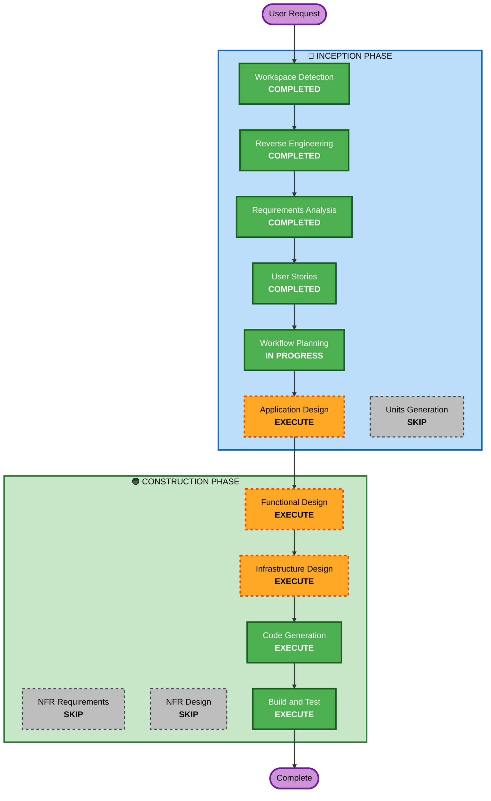

# Execution Plan

## Detailed Analysis Summary

### Transformation Scope (Brownfield)
- **Transformation Type**: Multi-component — 프론트 흐름 재구성 + 신규 데이터 모델 + 인프라 룰 수정
- **Primary Changes**: 영상 라이브러리(신규 Video 모델·S3 키 구조), 업로드/선택 화면 3종, S3 복사 기반 처리 시작, EventBridge suffix 룰 수정
- **Related Components**:
  - `src/pages/` — UnifiedUploadComponent(전면 개편), VideoUploadComponent·LongVideoUploadComponent(선택+폼 화면으로 대체), MainComponent(네비게이션)
  - `src/apis/` — 신규 video.ts(라이브러리 CRUD·복사·레거시 대사), history.ts·longVideoEdit.ts(재사용)
  - `amplify/data/resource.ts` — 신규 Video 모델
  - `amplify/backend.ts` — EventBridge 쇼츠 룰 수정
  - `amplify/storage/` — 라이브러리 키 경로 권한 (필요시)

### Change Impact Assessment
- **User-facing changes**: Yes — 업로드·처리 진입 흐름 전면 개편 (US-1~US-7)
- **Structural changes**: Yes — 라이브러리 계층 신설 (업로드와 처리의 분리)
- **Data model changes**: Yes — 신규 Video 모델 (기존 모델 변경 없음)
- **API changes**: No — GraphQL 스키마에 모델 추가만, 기존 계약 불변 (NFR-1)
- **NFR impact**: 제한적 — 권한(owner) 동일 패턴, 5GB 복사 한도 안내 (NFR-2/3)

### Component Relationships
- **Primary**: 프론트 업로드/선택 화면 3종 + video.ts API
- **Infrastructure**: amplify/data(Video 모델), amplify/backend(EventBridge 룰)
- **Dependent**: 기존 파이프라인(불변 — 복사로 진입), History/Gallery 화면(불변)
- **Supporting**: 테스트 (Vitest + fast-check PBT, 기존 테스트 갱신)

### Risk Assessment
- **Risk Level**: Medium — 여러 컴포넌트에 걸치지만 파이프라인 계약 불변으로 격리, 롤백은 git revert + 재배포로 가능
- **Rollback Complexity**: Moderate — Video 모델은 추가만이라 롤백 시 잔존해도 무해. EventBridge 룰 수정은 이전 패턴 복원으로 롤백
- **Testing Complexity**: Moderate — 화면 상태 분기(빈 목록/레거시 유실/대용량)와 키 로직 PBT

## Workflow Visualization



### Text Alternative
```
INCEPTION: Workspace Detection(완료) → Reverse Engineering(완료) → Requirements(완료)
           → User Stories(완료) → Workflow Planning(진행중) → Application Design(실행) → Units Generation(생략)
CONSTRUCTION (단일 유닛): Functional Design(실행) → NFR Requirements(생략) → NFR Design(생략)
           → Infrastructure Design(실행) → Code Generation(실행) → Build and Test(실행)
```

## Phases to Execute

### 🔵 INCEPTION PHASE
- [x] Workspace Detection (COMPLETED)
- [x] Reverse Engineering (COMPLETED)
- [x] Requirements Analysis (COMPLETED)
- [x] User Stories (COMPLETED)
- [x] Execution Plan (IN PROGRESS)
- [ ] Application Design - **EXECUTE**
  - **Rationale**: 신규 컴포넌트(Video 모델, video.ts API, VideoPicker 등)와 컴포넌트 간 계약(복사 키 규칙, 레거시 대사)이 새로 정의되어야 함
- [ ] Units Generation - **SKIP**
  - **Rationale**: 프론트+스키마+룰 1곳이 강하게 결합된 단일 배포 단위 — 분할 시 오히려 조정 비용 증가. 단일 유닛 "upload-library"로 진행

### 🟢 CONSTRUCTION PHASE (단일 유닛: upload-library)
- [ ] Functional Design - **EXECUTE**
  - **Rationale**: 신규 데이터 모델(Video)·키 스킴·레거시 대사 로직 설계 필요. PBT-01(속성 식별)이 이 단계에 걸려 있음 (blocking)
- [ ] NFR Requirements - **SKIP**
  - **Rationale**: 신규 NFR 없음 — 기존 스택 그대로, 권한·성능 요구는 requirements.md NFR-1~5로 이미 확정. PBT-09(프레임워크 선정)는 Functional Design에서 fast-check로 함께 기록
- [ ] NFR Design - **SKIP**
  - **Rationale**: NFR Requirements 생략에 따름
- [ ] Infrastructure Design - **EXECUTE**
  - **Rationale**: EventBridge 룰 수정(FR-5)·라이브러리 S3 키/권한 설계 — 인프라 변경이 실재함
- [ ] Code Generation - **EXECUTE** (ALWAYS)
- [ ] Build and Test - **EXECUTE** (ALWAYS)
  - **Quality Gates**: tsc, ESLint(변경 파일), Vitest(+fast-check PBT), pytest 회귀, PBT-08 준수

## Estimated Timeline
- **Total Phases**: 5 (Application Design → Functional Design → Infrastructure Design → Code Generation → Build & Test)
- **Estimated Duration**: 단일 세션 내 연속 실행 (자동 승인 방침 적용)

## Success Criteria
- **Primary Goal**: US-1~US-8 수용 기준 전부 충족
- **Key Deliverables**: 라이브러리 업로드 화면, 쇼츠/화자별 선택+폼 화면, Video 모델, EventBridge 룰 수정, 테스트(예제+PBT)
- **Quality Gates**: 빌드/린트/테스트 통과 + PBT Compliance (blocking) + 배포 후 실환경 검증(배포는 사용자 확인 후)
