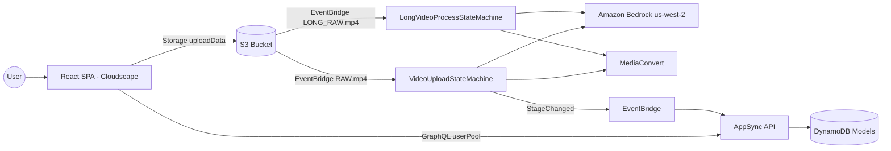
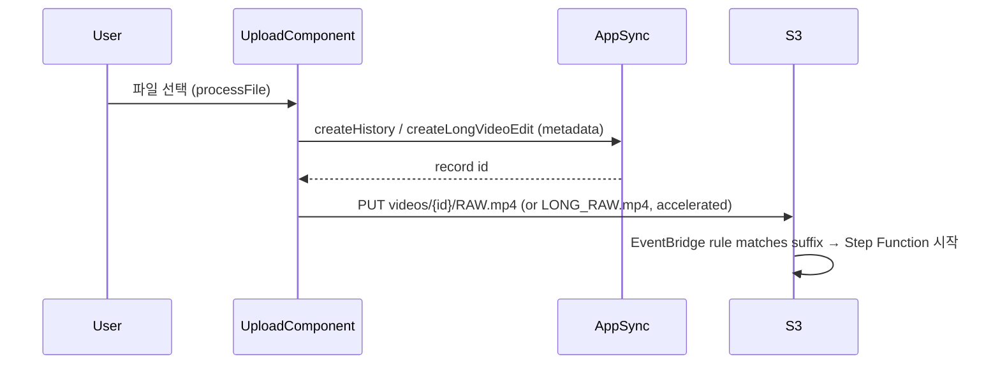

# System Architecture

## System Overview
AWS Amplify Gen2 서버리스 웹앱. React SPA(Cognito 인증) + AppSync GraphQL(DynamoDB) + S3(EventBridge 알림) + Step Functions 5개 + Python Lambda + MediaConvert/Transcribe/Bedrock.

## Architecture Diagram

## Component Descriptions

### Upload flow (이번 수정의 대상)
| Route | Component | 현재 동작 |
|---|---|---|
| `/upload` | `UnifiedUploadComponent` | 런처: 카드 3개(쇼츠만들기 → `/`, 화자별 편집 → `/longvideo`, YouTube 업로드 → `/youtube/uploads`)로 이동만 함 |
| `/` | `VideoUploadComponent` | Tiles(신규 업로드 / S3 URI 입력) + 모델·클립수·테마·길이 폼 + StorageManager 업로드 → `createHistory` 후 `{id}/RAW.mp4` 키로 업로드 → `/history` 이동 |
| `/longvideo` | `LongVideoUploadComponent` | 모델·발표자수·이름 폼 + StorageManager → `createLongVideoEdit` 후 `{id}/LONG_RAW.mp4` 키로 업로드 → `/longvideo/history` 이동 |

### Upload sequence (양쪽 공통 패턴)

**중요**: 메타데이터 레코드는 **업로드 시작 전에** 생성된다(키에 record id가 필요). 파이프라인 트리거는 S3 PUT 이벤트다.

## Data Flow — "기존 영상 선택" 시 필요한 것
- 업로드된 원본 위치: `videos/{historyId}/RAW.mp4` 또는 `videos/{editId}/LONG_RAW.mp4` (스토리지 경로 prefix `videos/`는 StorageManager `path` prop)
- 기존 영상을 다른(또는 같은) 파이프라인으로 재처리하려면: 새 레코드 생성 → S3 CopyObject로 `videos/{newId}/RAW.mp4`(또는 LONG_RAW.mp4) 생성 → EventBridge가 자동 트리거
- 프론트에서 S3 copy는 Amplify Storage `copy` API로 가능 (`aws-amplify/storage`의 `copy`)

## Integration Points
- **External APIs**: YouTube Data API (OAuth, Secrets Manager)
- **Databases**: DynamoDB — History, Highlight, Gallery, LongVideoEdit, LongVideoSegment, LongVideoOutput, YouTubeUpload, ManagedModel
- **Third-party Services**: Amazon Bedrock (us-west-2, cross-region inference profiles)

## Infrastructure Components
- **CDK (Amplify Gen2) 구성**: `amplify/backend.ts` 단일 정의 + custom constructs (`amplify/custom/`)
- **Deployment Model**: main push → Amplify Hosting 자동 빌드/배포 (app d32g3633tipi0o)
- **호스팅 URL**: https://main.d32g3633tipi0o.amplifyapp.com
