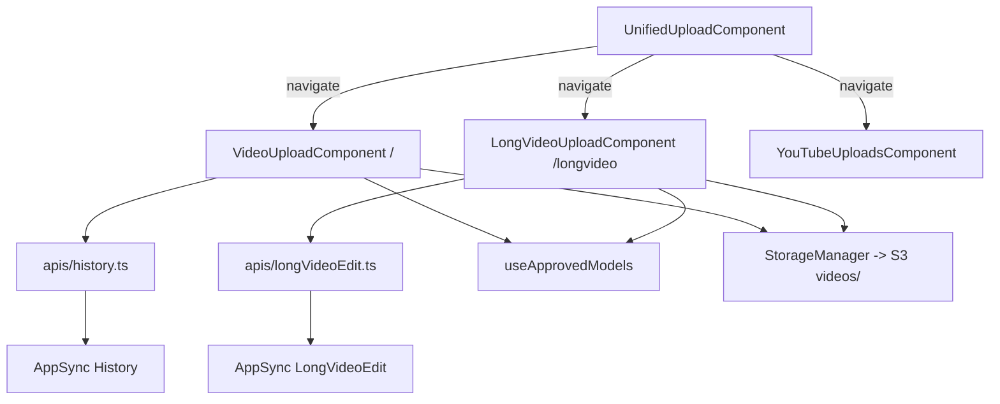

# Dependencies

## Internal Dependencies

### UnifiedUploadComponent depends on react-router navigate
- **Type**: Runtime
- **Reason**: 런처는 현재 라우팅 전용 — 업로드 로직/폼 없음

### 업로드 컴포넌트 → record-first 패턴
- **Type**: Runtime
- **Reason**: S3 키에 레코드 id 필요 (`videos/{id}/RAW.mp4`)

## External Dependencies
### @aws-amplify/ui-react-storage (StorageManager)
- **Purpose**: 업로드 UI + S3 PUT (accelerated)
### aws-amplify/storage
- **Purpose**: `copy`/`list` — 기존 영상 재사용 구현 시 사용 후보
### @cloudscape-design/components
- **Purpose**: 전체 UI 컴포넌트
